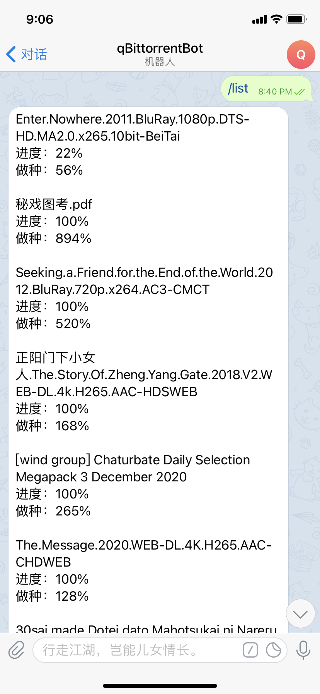

# qBittorrentBot



## 功能列表
* 配置qBittorrentBot服务器
* 查看下载进度
* 添加磁力下载

## 安装与使用
config.yml
```
telegraph_token: 必填，telegram机器人token
db_log: 是否生成数据库日志，默认为false
```
### 源码运行
```
git clone https://github.com/AlanLang/qBittorrentBot.git
go run *.go
```
### Docker 部署
需要映射config目录，目录下包含config.yml文件
```
docker run -itd --name qbittorrentbot --restart=always -v /目录/config:/config langwenda/qbittorrentbot
```
### 使用命令
```
/start 开始使用
/list 查看下载列表
/help 帮助
/config 配置qBittorrent服务器
url 添加磁力下载
```
